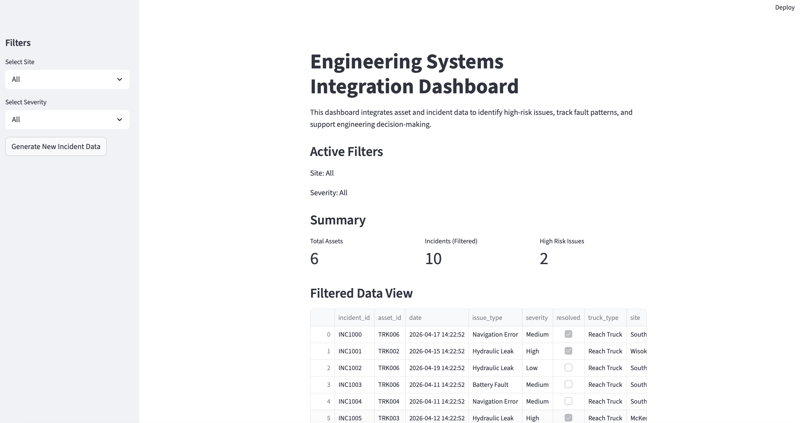

# Engineering Alert Dashboard

## 🚀 Live App

👉 https://engineering-alert-dashboard-pnqbffio69hkiqr8swfet7.streamlit.app

---

## 📊 Dashboard Preview

---

## 📌 Overview

This project is a **Streamlit-based engineering dashboard** designed to monitor asset incidents and identify high-risk issues in real time.

It integrates asset and incident data to support **data-driven engineering decisions**, highlight critical faults, and prioritise maintenance actions.

---

## ⚙️ Features

- 📊 Incident Monitoring Dashboard  
- ⚠️ Critical Alert Detection (high severity + repeat issues)  
- 📈 Asset Risk Scoring & Ranking  
- 🔍 Filtering by Site and Severity  
- 🗺️ Incident Visualisation by Site  
- 🔄 Simulated Incident Data Generation  

---

## 🧠 How It Works

1. Asset data is loaded (simulated or via API)  
2. Incident data is generated or ingested  
3. Data is merged and analysed  
4. Risk scoring logic identifies high-risk assets  
5. Dashboard updates dynamically based on filters  

---

## 🛠️ Tech Stack

- Python  
- Streamlit  
- Pandas  
- Requests (for API integration)  

---

## 📂 Project Structure
